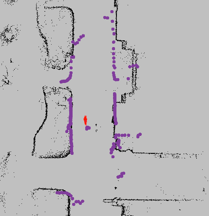
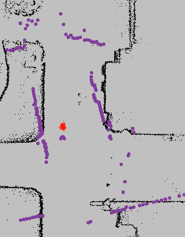

# emcl2_ros2のパラメータ調整方法_1

直進区間で最初に確認する候補は、`odom_fw_dev_per_fw`と`odom_rot_dev_per_fw`です。
ここでは、オドメトリ誤差に関する4つのパラメータの意味と調整方法を説明します。

デフォルト値で自己位置推定が安定している場合は、無理に変更する必要はありません。

---

## オドメトリ誤差パラメータの説明

これらのパラメータは、**オドメトリの信頼度**に関わります。
値を大きくすると「オドメトリの誤差が大きい」と判断し、パーティクルが広がりやすくなります。
値を小さくするとオドメトリを信用し、パーティクルがまとまりやすくなります。

屋外ではタイヤの滑りや路面の凹凸によってオドメトリ誤差が発生しやすいため、小さくしすぎると正しい位置を候補として残せない場合があります。

:bulb: 直進主体の走行では、`odom_fw_dev_per_fw`と`odom_rot_dev_per_fw`の影響が大きくなります。

### `odom_fw_dev_per_fw`

- **意味**：前進・後退によって発生する、前進方向の誤差 *(default: 0.19)*
- 直進時に、パーティクルの位置を進行方向へ広げるためのパラメータです
- 値を大きくすると、パーティクルが進行方向へ広がりやすくなります
- 値を小さくすると、オドメトリが示す位置付近にまとまりやすくなります

<!-- ここに、値を小さくした場合と大きくした場合の比較画像を挿入 -->

### `odom_rot_dev_per_fw`

- **意味**：前進・後退によって発生する、回転方向の誤差 *(default: 0.13)*
- 直進時に、パーティクルの向きを左右へ広げるためのパラメータです
- 値を大きくすると、パーティクルが扇状に広がりやすくなります
- 真っすぐ走行しているのにLaserScanが地図に対して斜めにずれる場合に確認します

<!-- ここに、値を小さくした場合と大きくした場合の比較画像を挿入 -->

### `odom_fw_dev_per_rot`

- **意味**：回転によって発生する、前進方向の誤差 *(default: 0.0001)*
- その場回転時に、パーティクルの位置方向への広がりに影響します
- 直進主体の走行では、このパラメータの影響は小さくなります
- その場回転後に自己位置の位置がずれる場合に確認します

<!-- ここに、その場回転時のパーティクルの位置方向への広がりを示す画像を挿入 -->

### `odom_rot_dev_per_rot`

- **意味**：回転によって発生する、回転方向の誤差 *(default: 0.2)*
- その場回転時に、パーティクルの向きの広がりに影響します
- 値を大きくすると、回転時にパーティクルの向きが広がりやすくなります
-  その場回転後にLaserScanの角度が地図と合わない場合に確認します

<!-- ここに、その場回転時のパーティクルの向きの広がりを示す画像を挿入 -->

---
### 3. 問題の特定とパラメータ調整

#### a. 並進方向のずれ → `odom_fw_dev_per_fw`

以下の図のように、直進中にスキャンデータと地図が進行方向へずれている場合：

- `odom_fw_dev_per_fw`を現在値から**0.02～0.05ずつ増加**させます
- 同じrosbagを再生し、並進方向のずれが発生する箇所が減るか確認します
- 値を大きくすると、前進時にパーティクルが進行方向へ広がりやすくなります
- 大きくしすぎると、パーティクルが広がりすぎて推定位置が不安定になるため注意してください

<!-- 直進中、紫色のスキャンデータが黒い地図の壁に対して
     前後方向へ平行にずれている画像を挿入 -->

#### b. 回転方向のずれ → `odom_rot_dev_per_fw`

以下の図のように、直進中にスキャンデータが地図に対して斜めにずれている場合：

- `odom_rot_dev_per_fw`を現在値から**0.02～0.05ずつ増加**させます
- 同じrosbagを再生し、回転方向のずれが発生する箇所が減るか確認します
- 値を大きくすると、前進時にパーティクルの向きが広がりやすくなります
- 大きくしすぎると、推定姿勢が左右に不安定になるため注意してください

<!-- 直進中、紫色のスキャンデータが黒い地図の壁に対して
     角度を持って斜めにずれている画像を挿入 -->

#### c. パーティクルが広がりすぎて推定位置が不安定になる場合

以下の図のように、パーティクルが広い範囲に散らばり、スキャンデータと地図の一致が安定しない場合：

- 直進時に発生する場合は、`odom_fw_dev_per_fw`または`odom_rot_dev_per_fw`を少しずつ減少させます
- 一度に両方を変更せず、1つずつ変更して結果を比較します
- パーティクルが広がること自体は異常ではありません
- 広がった後に収束せず、誤った位置や向きへ推定される場合に調整してください

<!-- パーティクルが広範囲に散らばり、
     スキャンデータと地図も一致していない画像またはGIFを挿入 -->
