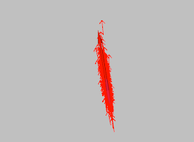
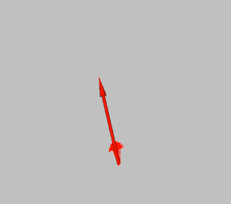

# emcl2_ros2のパラメータ調整方法_1

直進区間で最初に確認する候補は、`odom_fw_dev_per_fw`と`odom_rot_dev_per_fw`です。
ここでは、オドメトリ誤差に関する4つのパラメータの意味と調整方法を説明します。

デフォルト値で自己位置推定が安定している場合は、無理に変更する必要はありません。(津田沼チャレンジのコースではデフォルトの値でも安定しています)

---

## 💡 調整の目標と良くない状態

パラメータを調整する前に、現在の推定状態がどのような状態かを見極めましょう。
ただ「ロスト（迷子）していないからOK」ではありません

*   🟢 **目標とする状態**
    *   ロボットが動いても、紫の点群（スキャンデータ）が黒い線（地図）に**吸い付くように滑らかに**追従する。
    *   パーティクルがロボットの周囲に過不足なくまとまっている。

*   🔴 **良くない状態（ロストしていなくても注意）**
    *   **スキャンデータのブレ：** 紫の点群が地図の上で常にピクピクと震えている。
    *   **追従の遅れ：** ロボットが旋回したとき、紫の点群が斜めにズレたまま踏ん張り、少し遅れてから「バチッ」と地図に合う。

⚠️ **なぜスキャンデータの「ブレ」が良くないのか？**
画面上で自己位置がピクピク震えているということは、内部の座標データが数センチ単位でワープし続けている状態です。これを自律走行（Nav2など）に渡すと、ロボットが「経路からズレた！」と勘違いし、**無駄な急ハンドル、蛇行運転、急ブレーキ**を引き起こしてしまいます。スムーズな走行のためには、このブレを最小限に抑える必要があります。

---

## オドメトリ誤差パラメータの説明

これらのパラメータは、**オドメトリの信頼度**に関わります。
値を大きくすると「オドメトリの誤差が大きい」と判断し、パーティクルが広がりやすくなります。
値を小さくするとオドメトリを信用し、パーティクルがまとまりやすくなります。

屋外ではタイヤの滑りや路面の凹凸によってオドメトリ誤差が発生しやすいため、小さくしすぎると正しい位置を候補として残せない場合があります。

:bulb: 直進主体の走行では、`odom_fw_dev_per_fw`と`odom_rot_dev_per_fw`の影響が大きくなります。

### `odom_fw_dev_per_fw`

- **意味**：前進・後退によって発生する、前進方向の誤差 *(default: 0.19)*
- 直進時に、パーティクルの位置を進行方向へ広げるためのパラメータです

**【パラメータ値による違いの比較】**

| 値を大きくした場合 (例: 0.8) | 値を小さくした場合 (例: 0.01) |
| :---: | :---: |
|  |  |
| パーティクルが進行方向に沿って大きく広がる | オドメトリを信用し、一点にまとまりやすくなる |

> 💡 **なぜ網（パーティクル）を広げる必要があるの？**
> *   **小さすぎの罠:** タイヤが滑って実際の位置がズレたとき、パーティクルがまとまりすぎていると「正解の位置」が候補から漏れてしまい、迷子になります。
> *   **大きすぎの罠:** 広げすぎると、似た風景（別の壁など）に誤収束したり、現在地がフラフラして前述の「スキャンデータのブレ」を引き起こします。
> *   **目標:** 「実際のタイヤの滑り（ズレ）をギリギリカバーできる最小サイズ」を目指しましょう。

### `odom_fw_dev_per_rot`

- **意味**：回転によって発生する、前進方向の誤差 *(default: 0.0001)*
- その場回転時に、パーティクルの位置方向への広がりに影響します
- 直進主体の走行では、このパラメータの影響は小さくなります

**【極端に大きくした場合 (例: 0.5) のイメージ】**

*(回転しているのに、前後に向かってパーティクルが伸びる)*

> 💡 **なぜ回転しているのに「前後の広がり」を調整するの？**
> 理想的なロボットはコマのようにその場で綺麗に回転しますが、屋外の路面環境ではタイヤの摩擦や滑りによって**回転の軸がブレて、前後に少し動いてしまう**ことがよくあります。
> 旋回直後に自己位置が前後にズレる場合は、この値を大きくしてズレをカバーします。

### `odom_rot_dev_per_rot`

- **意味**：回転によって発生する、回転方向の誤差 *(default: 0.2)*
- その場回転時に、パーティクルの向きの広がりに影響します
- 値を大きくすると、回転時にパーティクルの向きが広がりやすくなります
-  その場回転後にLaserScanの角度が地図と合わない場合に確認します

<!-- ここに、その場回転時のパーティクルの向きの広がりを示す画像を挿入 -->

---
## 3. 問題の特定とパラメータ調整

#### a. 並進方向のずれ → `odom_fw_dev_per_fw`

以下の図のように、直進中にスキャンデータと地図が進行方向へずれている場合：

- `odom_fw_dev_per_fw`を現在値から**0.02～0.05ずつ増加**させます
- 同じrosbagを再生し、並進方向のずれが発生する箇所が減るか確認します
- 値を大きくすると、前進時にパーティクルが進行方向へ広がりやすくなります
- 大きくしすぎると、パーティクルが広がりすぎて推定位置が不安定になるため注意してください

<!-- 直進中、紫色のスキャンデータが黒い地図の壁に対して
     前後方向へ平行にずれている画像を挿入 -->

#### b. 回転方向のずれ → `odom_rot_dev_per_fw`

以下の図のように、直進中にスキャンデータが地図に対して斜めにずれている場合：

- `odom_rot_dev_per_fw`を現在値から**0.02～0.05ずつ増加**させます
- 同じrosbagを再生し、回転方向のずれが発生する箇所が減るか確認します
- 値を大きくすると、前進時にパーティクルの向きが広がりやすくなります
- 大きくしすぎると、推定姿勢が左右に不安定になるため注意してください

<!-- 直進中、紫色のスキャンデータが黒い地図の壁に対して
     角度を持って斜めにずれている画像を挿入 -->

#### c. パーティクルが広がりすぎて推定位置が不安定になる場合

以下の図のように、パーティクルが広い範囲に散らばり、スキャンデータと地図の一致が安定しない場合：

- 直進時に発生する場合は、`odom_fw_dev_per_fw`または`odom_rot_dev_per_fw`を少しずつ減少させます
- 一度に両方を変更せず、**1つずつ変更して**結果を比較します
- パーティクルが広がること自体は異常ではありません
- 広がった後に収束せず、誤った位置や向きへ推定される場合に調整してください

<!-- パーティクルが広範囲に散らばり、
     スキャンデータと地図も一致していない画像またはGIFを挿入 -->

---
## 4. 調整の終わり（ゴール）

パラメータを1つずつ調整し、以下の状態になればチューニングは完了です！

✅ コントローラー操作時のrosbagで、自己位置が完全に破綻（ロスト）する箇所がない
✅ 旋回時や直進時に、スキャンデータと地図が「ブレ」にならず、滑らかに追従している

調整完了後は、実ロボットを使って自律走行（Nav2）を行い、蛇行せずスムーズに走行できるか確認しましょう。