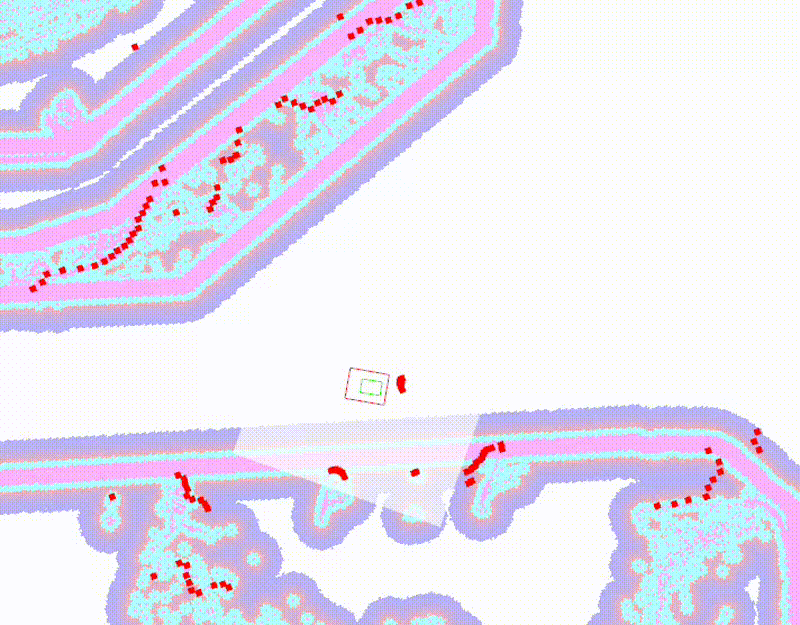
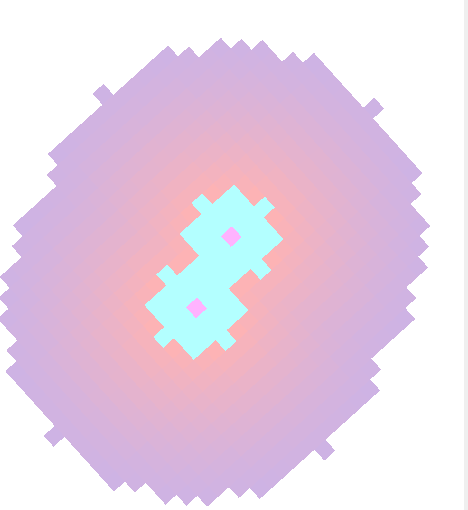
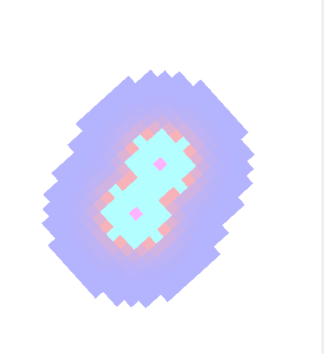

# グローバルコストマップ (Global Costmap)

グローバルコストマップは、事前に作成した静的マップ（地図）をベースに、スタートからゴールまでの全体的な経路計画（グローバルプランニング）を行うためのコストマップです。

津田沼チャレンジのコースのような広範囲のナビゲーションにおいて、事前にglim等で作成したマップ上の壁や構造物に対してコストを付与し、安全な大枠のルートを決定する役割を持ちます。

## 基本パラメータ

`nav2_params.yaml` 内の `global_costmap` 名前空間で定義されています。

*   **`update_frequency`** (現在値: 3.0)
    *   意味: マップの更新周波数(Hz)。ローカルコストマップと異なり、静的な地図がメインとなるため、CPU負荷を下げるために少し低めの値に設定されています。
*   **`publish_frequency`** (現在値: 3.0)
    *   意味: RViz等へマップ情報を送信する周波数(Hz)。
*   **`resolution`** (現在値: 0.1)
    *   意味: マップの解像度。事前作成したマップの解像度と合わせるのが基本です。

## プラグイン層 (Plugins)
Nav2のコストマップは複数のレイヤー（層）を重ねて構成されています。

*   `static_layer`: 事前に作成した静的マップを読み込む層。
*   `obstacle_layer`: 走行中のセンサ（LiDAR等）から障害物を一時的にマッピングする層。
*   `inflation_layer`: 障害物の周囲に危険度（コスト）のグラデーションを展開する層。

---

## inflation_layer (コストの膨張設定)

障害物からの距離に応じてコスト（危険度）を膨張させる設定です。ここを調整することで、ロボットが壁からどれくらい離れて走行するかを制御できます。

*   **`inflation_radius`** (現在値: 1.25)
    *   意味: 障害物のコスト値をインフレーション（膨張）させる最大半径(m)。
    *   下図のように、`static_layer` で登録されているマップ全体のコストを膨張させます。

> **※インフレーション半径（inflation_radius）の調整による変化**
> 
*   **`cost_scaling_factor`** (現在値: 3.0)
    *   意味: インフレーション時にコスト値に適用するスケーリング係数。
    *   この値を変更すると、コストのスケール（グラデーションの急峻さ）が変更されます。値を大きくしすぎると、`inflation_radius` の値を大きくしても、極端に限られた範囲でしかコストを膨張させることができないので注意が必要です。

> **※ cost_scaling_factor (1.0, 10.0, 20.0) の比較**
> 
> 
> 