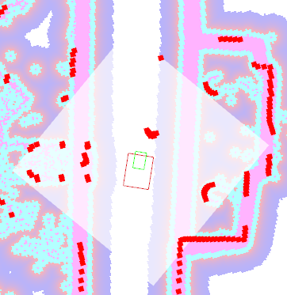

# ローカルコストマップ (Local Costmap)

ローカルコストマップは、ロボットの周辺環境のみを切り出し、リアルタイムな障害物回避や細かな経路計画（ローカルプランニング）を行うためのコストマップです。

グローバルコストマップが事前に作成した「地図全体」を扱うのに対し、こちらは「ロボットのすぐ近く」に特化しており、LiDARなどのセンサ情報を使って歩行者や新しい障害物などの動的な変化を即座に反映する役割を持ちます。

## 基本パラメータ

`nav2_params.yaml` 内の `local_costmap` 名前空間で定義されています。

### 🌟 重要なパラメータ（調整の頻度：高）

*   **`width` / `height`** (現在値: 10 / 10)
    *   意味: ローカルコストマップのサイズ（m）。ロボットを中心とした正方形の展開範囲を指定します。
    *   **調整のコツ:** 値を大きくすれば遠くの障害物も前もって回避計画に組み込めますが、その分PCの計算負荷（CPU）が大きくなります。反対に小さくしすぎると、障害物の発見が遅れて急ブレーキや衝突の原因になるため、ロボットの走行速度に合わせた適切なサイズが必要です。（現状は10m×10mと比較的広めに取られています）

> **※ ローカルコストマップ（width / height）の展開範囲**
> 
> （※ロボットの周囲に展開されている半透明の白いエリアがローカルコストマップの範囲です）

*   **`footprint`** 赤色の四角(現在値: `"[ [-0.3, -0.3], [-0.3, 0.3], [0.6, 0.3], [0.6, -0.3] ]"`)
    *   意味: ロボット自身のサイズや形（輪郭）を定義する多角形の頂点座標です。
    *   **調整のコツ:** ローカルプランナーが壁や障害物と衝突しないかを計算する際の基準になります。ORNE-boxのような長方形の機体では、ここを実機に合わせて正確に設定することが、壁際での安全な自律移動に直結します。

### 🔧 その他の基本パラメータ

*   **`update_frequency`** (現在値: 5.0): マップの更新周波数(Hz)。動的な障害物に素早く対応するため、グローバル(3.0)より高めです。
*   **`publish_frequency`** (現在値: 5.0): RViz等へマップ情報を送信する周波数(Hz)。
*   **`global_frame`** (現在値: odom): ローカルコストマップの基準座標系。ロボットの相対的な動きを重視するため、`map` ではなく `odom` が使われます。
*   **`robot_base_frame`** (現在値: base_link): ロボットの中心を示す座標系。
*   **`rolling_window`** (現在値: True): ロボットの移動に合わせてコストマップの枠も一緒に移動（スクロール）するかどうかの設定。ローカルでは必須です。
*   **`resolution`** (現在値: 0.1): マップの1セルのサイズ(m)。
*   **`always_send_full_costmap`** (現在値: False): 差分だけではなく常にマップ全体を送信するかどうか。通信帯域節約のためFalse推奨。

---

## プラグイン層 (Plugins)

ローカルコストマップは、事前地図（static_layer）を持たず、以下の2つの層を重ねて構成されています。

### 1. obstacle_layer (障害物レイヤー)
走行中のセンサ（LiDAR等）から得られた最新の障害物情報をマッピングする層です。

#### 🌟 重要なパラメータ（調整の頻度：高）
*   **`obstacle_max_range`** (現在値: 3.5)
    *   意味: センサから障害物としてコストマップに書き込む（黒く塗る）最大距離(m)。
    *   **調整のコツ:** この距離より遠くにある障害物は無視されます。数値を大きくすると遠くの障害物も認識しますが、ノイズも拾いやすくなります。
*   **`raytrace_max_range`** (現在値: 4.0)
    *   意味: センサから障害物がない空きスペースとしてクリア（白く塗る）する最大距離(m)。
    *   **調整のコツ:** 過去に障害物があった場所でも、LiDARのレーザーがこの距離まで通り抜ければ「今は障害物がない」と判断してコストを消去します。基本的に `obstacle_max_range` より少し大きい値を設定します。

#### 🔧 その他のパラメータ (scan)
*   **`topic`** (現在値: /low_scan): サブスクライブするLiDARのトピック名。
*   **`obstacle_min_range`** (現在値: 0.0): 障害物として認識する最小距離。
*   **`raytrace_min_range`** (現在値: 0.0): クリアを行う最小距離。
*   **`max_obstacle_height` / `min_obstacle_height`**: 障害物として認識する高さの範囲(m)。2D LiDARの場合は主に無視するノイズ除去に使われます。
*   **`clearing`** (現在値: True): 障害物が無くなった時にコストマップから消去するかどうか。
*   **`marking`** (現在値: True): 障害物をコストマップに書き込むかどうか。
*   **`inf_is_valid`** (現在値: True): LiDARが無限遠(Inf)を返した時、そこには何もないとしてクリア処理に使うかどうか。
*   **`data_type`** (現在値: "LaserScan"): 受信するセンサデータの型。

### 2. inflation_layer (コストの膨張設定)
`obstacle_layer` で検知した障害物の周囲に、危険度（コスト）のグラデーションを展開する層です。考え方はグローバルコストマップと同じですが、ローカルでの急な衝突回避に直結します。

*   **`inflation_radius`** (現在値: 0.5): 障害物のコスト値を膨張させる最大半径(m)。グローバル(1.25)よりも小さく設定され、より小回りが利くようになっています。
*   **`cost_scaling_factor`** (現在値: 3.0): インフレーションの急峻さを決める係数。